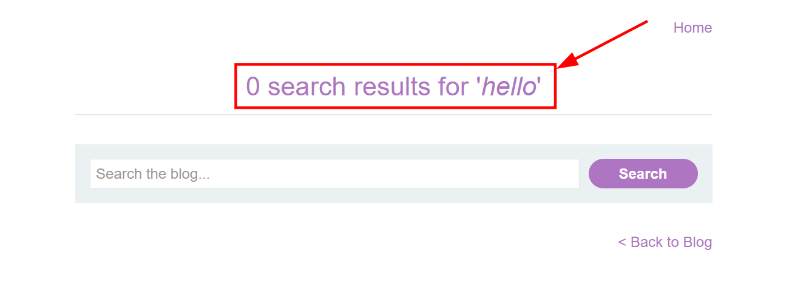
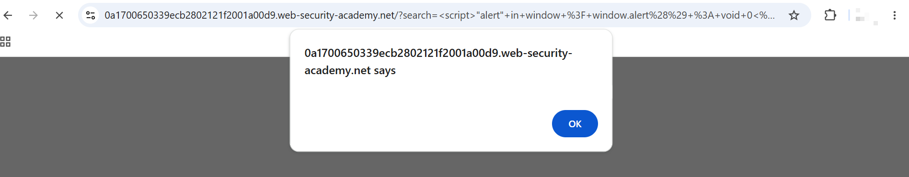

# Reflected XSS into HTML context with nothing encoded

This lab contains a simple reflected cross-site scripting vulnerability in the search functionality.

To solve the lab, perform a cross-site scripting attack that calls the `alert` function.

---

# 1. Detection
- I clicked on `ACCESS THE LAB` button and accessed the web application.
- I immediately saw a Search bar at the home page which allows the user to `Search the blog...` and a `Search` button.
- I search for a string `test` and hit enter, the word `test` was being reflected on the page as `1 search results for 'test'` and a blog.
- Then, I tried a simple HTML payload
```html
<i>hello</i>
```
- I could see my payload being rendered as HTML in the page.
- 

# 2. Popping an alert (Solving the lab)
- I immediately dropped a simple script to pop an alert box.
```javascript
<script>"alert" in window ? window.alert() : void 0</script>
```
- 
- The alert got triggered which solved the lab.