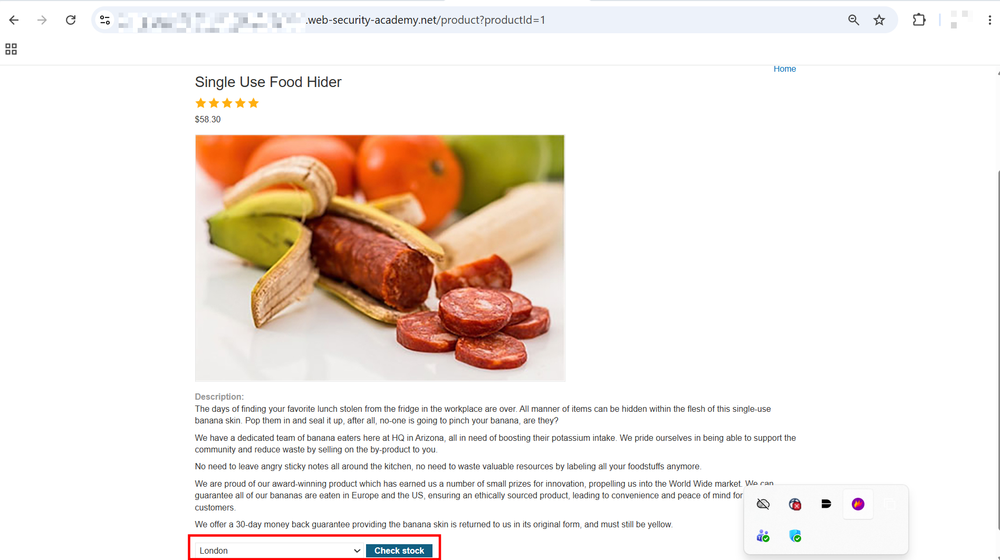
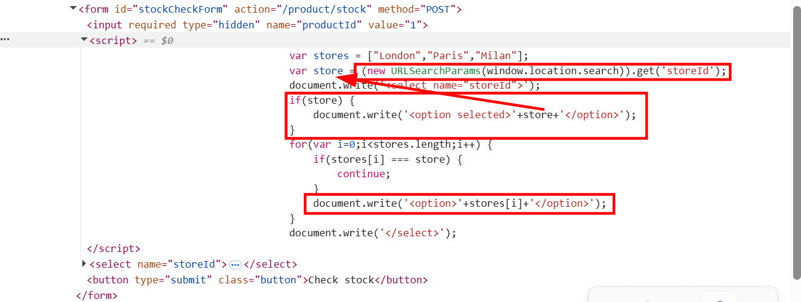
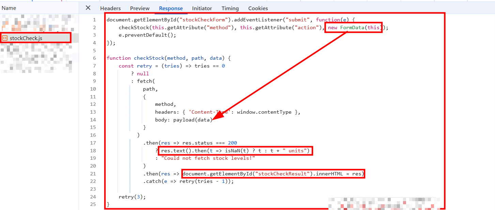
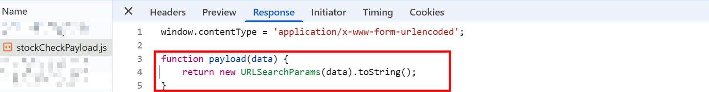
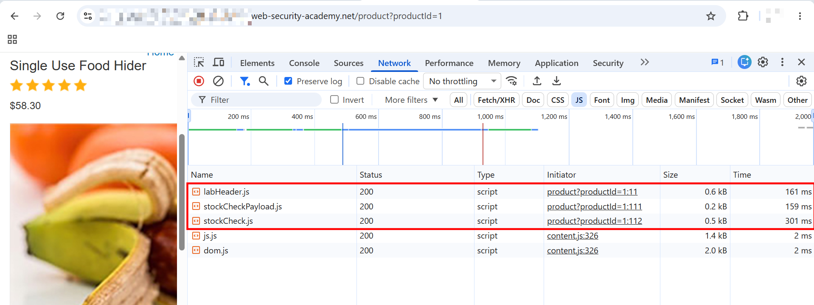
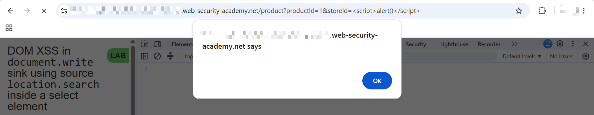

# DOM XSS in `document.write` sink using source `location.search` inside a select element

This lab contains a DOM-based cross-site scripting vulnerability in the stock checker functionality. It uses the JavaScript `document.write` function, which writes data out to the page. The `document.write` function is called with data from `location.search` which you can control using the website URL. The data is enclosed within a select element.

To solve this lab, perform a cross-site scripting attack that breaks out of the select element and calls the `alert` function.

---

## 1. Detection

- Accessed the lab and found the application has various products listed on the home page.


- Clicked on "View details" for one of the products and was taken to `/product?productId=1`.



- The page had a product image, description, a country select dropdown ("London", "Paris", "Milan"), and a "Check stock" button.
- Clicked "Check stock" and got a unit count back, e.g. `535 units`.

---

## 2. Reviewing the JavaScript

- Opened DevTools, switched to the `Network` tab filtered by `JS`, and reloaded the page. Found two relevant scripts being loaded: `/resources/js/stockCheckPayload.js` and `/resources/js/stockCheck.js`.



- Inspected `stockCheckPayload.js`:

```javascript
window.contentType = 'application/x-www-form-urlencoded';

function payload(data) {
    return new URLSearchParams(data).toString();
}
```



- This sets `window.contentType` and defines a `payload` function that converts a `data` object into a URL-encoded string using `URLSearchParams`. For example:

```javascript
new URLSearchParams({ 'name': 'Huzefa', 'email': 'huzefa@gmail.com' }).toString()
// 'name=Huzefa&email=huzefa%40gmail.com'
```

- Inspected `stockCheck.js`:

```javascript
document.getElementById("stockCheckForm").addEventListener("submit", function(e) {
    checkStock(this.getAttribute("method"), this.getAttribute("action"), new FormData(this));
    e.preventDefault();
});

function checkStock(method, path, data) {
    const retry = (tries) => tries == 0
        ? null
        : fetch(
            path,
            {
                method,
                headers: { 'Content-Type': window.contentType },
                body: payload(data)
            }
          )
            .then(res => res.status === 200
                ? res.text().then(t => isNaN(t) ? t : t + " units")
                : "Could not fetch stock levels!"
            )
            .then(res => document.getElementById("stockCheckResult").innerHTML = res)
            .catch(e => retry(tries - 1));

    retry(3);
}
```



- This listens for the `stockCheckForm` submit event and calls `checkStock` with the form's `method`, `action`, and a `FormData` object built from the form itself, while preventing the default form submission.
- Inside `checkStock`, a `retry` function fires a `fetch` request to `path` with the given `method`, a `Content-Type` header from `window.contentType`, and a body built via the `payload()` function. If the response status is `200`, it reads the response as text and appends `" units"` if it's numeric, otherwise prints it as-is. The result is written into `#stockCheckResult` via `.innerHTML`.
- This sink is **not exploitable** — the `.innerHTML` is only ever set from the server's *response*, which we don't control. Not the injection point.

---

## 3. Finding the Real Sink

- Inspected the form element itself and found the actual vulnerable code:

```html
<form id="stockCheckForm" action="/product/stock" method="POST">
    <input required="" type="hidden" name="productId" value="1">
    <script>
        var stores = ["London","Paris","Milan"];
        var store = (new URLSearchParams(window.location.search)).get('storeId');
        document.write('<select name="storeId">');
        if(store) {
            document.write('<option selected>'+store+'</option>');
        }
        for(var i=0;i<stores.length;i++) {
            if(stores[i] === store) {
                continue;
            }
            document.write('<option>'+stores[i]+'</option>');
        }
        document.write('</select>');
    </script><select name="storeId"><option>London</option><option>Paris</option><option>Milan</option></select>
    <button type="submit" class="button">Check stock</button>
</form>
```



- This was the actual vulnerability: `store` is read directly from `window.location.search` (the `storeId` query parameter) and concatenated into an `<option>` tag via `document.write`, with no sanitization or encoding.
- Since `document.write` is called with attacker-controlled data inside a `<select>` element, breaking out of the `<option>` tag with a `</select>` or script-closing payload would let arbitrary HTML/JS get written to the page.

---

## 4. Solve the Challenge

- Crafted a URL with a `storeId` parameter containing a script payload:

```
https://<REDACTED_LAB_ID>.web-security-academy.net/product?productId=1&storeId=<script>alert()</script>
```

- Navigated to this URL. Since `store` is inserted directly into the page via `document.write('<option selected>'+store+'</option>')` with no encoding, the injected `<script>alert()</script>` was written straight into the DOM and executed.



- Lab solved.