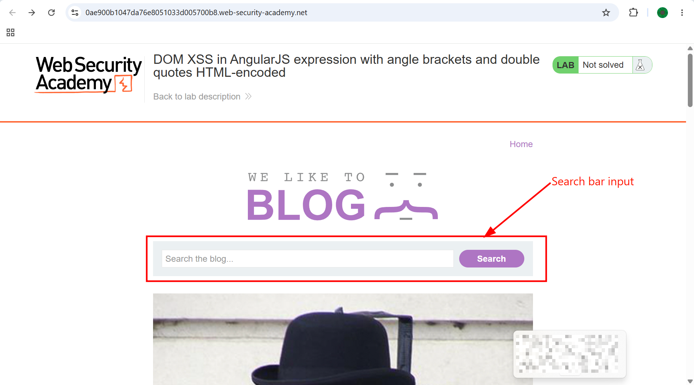
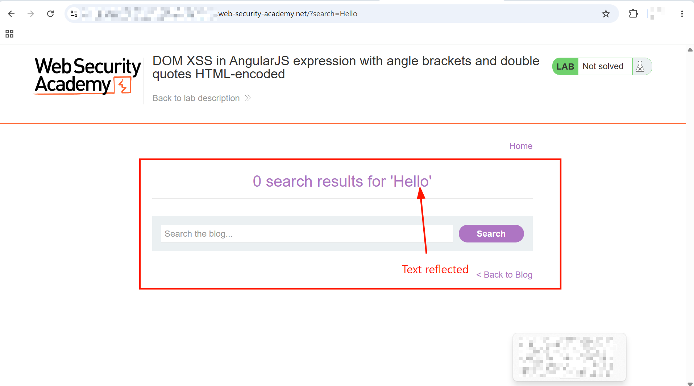
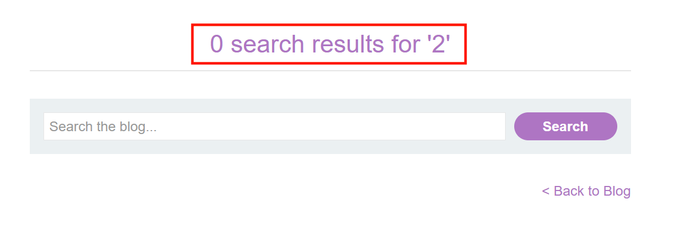
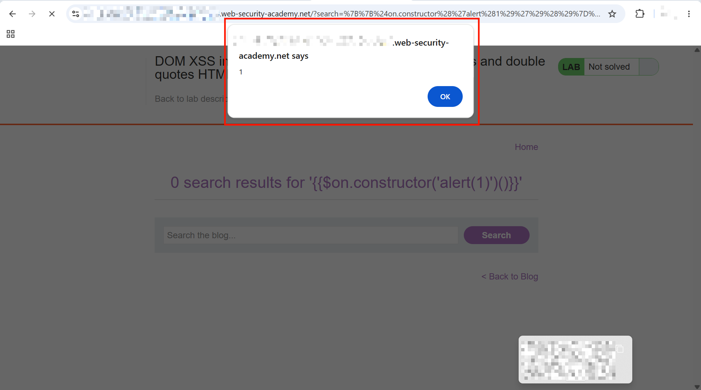

# DOM XSS in AngularJS expression with angle brackets and double quotes HTML-encoded

This lab contains a DOM-based cross-site scripting vulnerability in a AngularJS expression within the search functionality.

AngularJS is a popular JavaScript library, which scans the contents of HTML nodes containing the `ng-app` attribute (also known as an AngularJS directive). When a directive is added to the HTML code, you can execute JavaScript expressions within double curly braces. This technique is useful when angle brackets are being encoded.

To solve this lab, perform a cross-site scripting attack that executes an AngularJS expression and calls the `alert` function.

---

## 1. Detection

- Clicked `ACCESS THE LAB` and was presented with a search box on the blog page.



- Searched for the word `Hello` and saw the text reflected back above the search input: `0 search results for 'Hello'`.



---

## 2. Confirming AngularJS Expression Execution

- Since the lab description called out AngularJS (a front-end framework maintained by Google), searched on Google for `"angular add code within html"` and learned that AngularJS evaluates JavaScript expressions placed inside double curly braces `{{ }}` on any element scanned by an `ng-app` directive.
- Tested this by searching for:

```
{{1+1}}
```

- The page displayed:

```
0 search results for '2'
```



- This confirmed the application was actually evaluating the injected expression as AngularJS, not just reflecting it as plain text — `1+1` was computed server/client-side by Angular's expression parser and the result, `2`, was what got rendered.
- Tried `{{7*7}}` as a second confirmation and got `0 search results for '49'` back, further confirming arbitrary expression evaluation.

---

## 3. Solve the Challenge

- With the injection point confirmed, used a known Client-Side Template Injection (CSTI) payload for AngularJS that escapes the sandbox and calls `alert`:

```
{{$on.constructor('alert(1)')()}}
```

- Submitted this in the search box. The page rendered an `alert(1)` popup successfully.



> **Why this works:** Because angle brackets are HTML-encoded by the application, classic `<script>` injection doesn't work here. However, the search term is rendered inside an element scanned by AngularJS's `ng-app` directive, so any text placed inside `{{ }}` is evaluated as an AngularJS expression rather than displayed as plain text. The payload `$on.constructor('alert(1)')()` walks from the `$on` function reference, grabs its `constructor` (the JavaScript `Function` constructor), and uses it to dynamically create and immediately invoke a new function whose body is `alert(1)` — effectively reaching arbitrary JavaScript execution entirely through Angular's expression syntax, without needing any angle brackets at all.

- Lab solved.