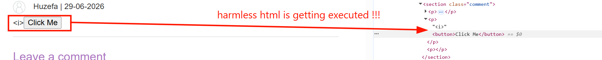
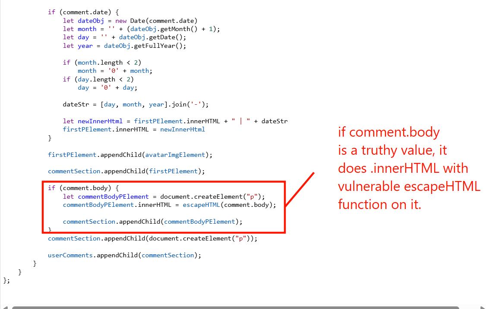
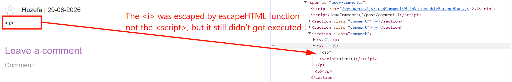
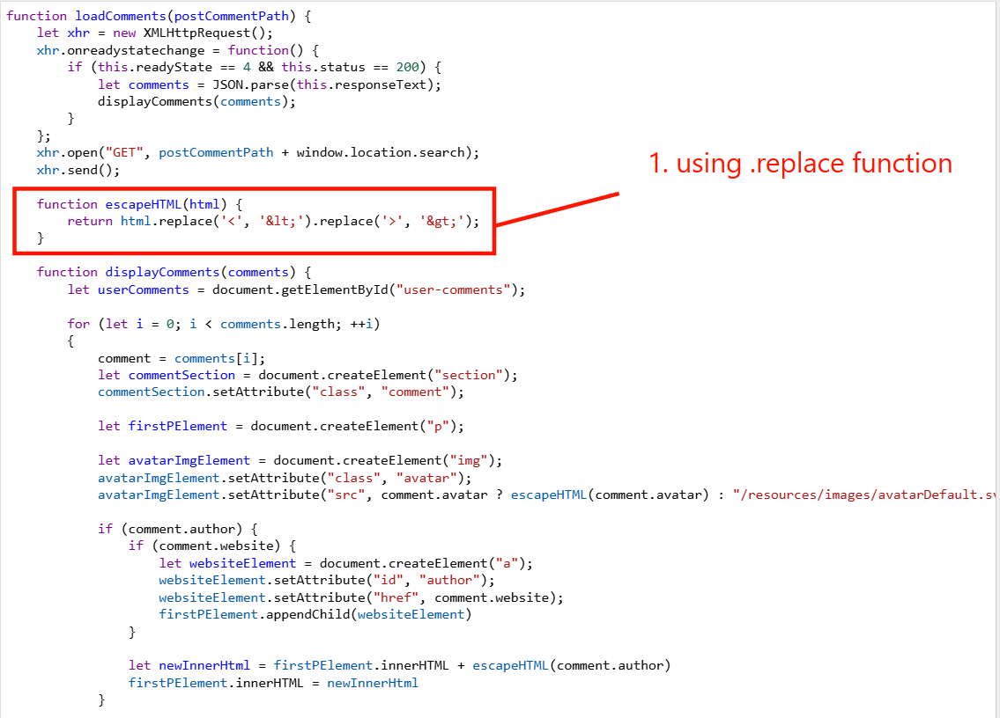
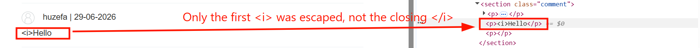
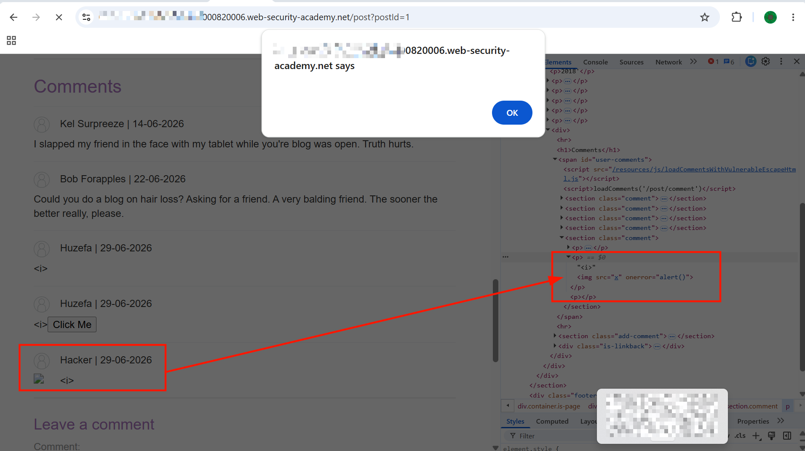

# Stored DOM XSS

This lab demonstrates a stored DOM vulnerability in the blog comment functionality. To solve this lab, exploit this vulnerability to call the `alert()` function.

---

## 1. Detection

- Accessed the lab. The home page listed multiple posts. Clicked on one of them, navigating to `/post?postId=1`.
- The post page had a form to leave a comment.


- Submitted a test comment to see how the application processes and renders it, using the payload `<i>Hello</i>` in the comment field.
- The output was unexpected — inspecting the rendered comment showed only the opening `<i>` tag had been escaped, while the closing `</i>` tag had not:



---

## 2. Reviewing the Front-End JavaScript

- Right above the rendered comments were two relevant `<script>` tags:

```html
<script src="/resources/js/loadCommentsWithVulnerableEscapeHtml.js"></script>
<script>loadComments('/post/comment')</script>
```

- Inspected `/resources/js/loadCommentsWithVulnerableEscapeHtml.js` to understand how `loadComments` renders comment data:

```javascript
function loadComments(postCommentPath) {
    let xhr = new XMLHttpRequest();
    xhr.onreadystatechange = function() {
        if (this.readyState == 4 && this.status == 200) {
            let comments = JSON.parse(this.responseText);
            displayComments(comments);
        }
    };
    xhr.open("GET", postCommentPath + window.location.search);
    xhr.send();

    function escapeHTML(html) {
        return html.replace('<', '&lt;').replace('>', '&gt;');
    }

    function displayComments(comments) {
        let userComments = document.getElementById("user-comments");

        for (let i = 0; i < comments.length; ++i)
        {
            comment = comments[i];
            let commentSection = document.createElement("section");
            commentSection.setAttribute("class", "comment");

            let firstPElement = document.createElement("p");

            let avatarImgElement = document.createElement("img");
            avatarImgElement.setAttribute("class", "avatar");
            avatarImgElement.setAttribute("src", comment.avatar ? escapeHTML(comment.avatar) : "/resources/images/avatarDefault.svg");

            if (comment.author) {
                if (comment.website) {
                    let websiteElement = document.createElement("a");
                    websiteElement.setAttribute("id", "author");
                    websiteElement.setAttribute("href", comment.website);
                    firstPElement.appendChild(websiteElement)
                }

                let newInnerHtml = firstPElement.innerHTML + escapeHTML(comment.author)
                firstPElement.innerHTML = newInnerHtml
            }

            if (comment.date) {
                let dateObj = new Date(comment.date)
                let month = '' + (dateObj.getMonth() + 1);
                let day = '' + dateObj.getDate();
                let year = dateObj.getFullYear();

                if (month.length < 2)
                    month = '0' + month;
                if (day.length < 2)
                    day = '0' + day;

                dateStr = [day, month, year].join('-');

                let newInnerHtml = firstPElement.innerHTML + " | " + dateStr
                firstPElement.innerHTML = newInnerHtml
            }

            firstPElement.appendChild(avatarImgElement);

            commentSection.appendChild(firstPElement);

            if (comment.body) {
                let commentBodyPElement = document.createElement("p");
                commentBodyPElement.innerHTML = escapeHTML(comment.body);

                commentSection.appendChild(commentBodyPElement);
            }
            commentSection.appendChild(document.createElement("p"));

            userComments.appendChild(commentSection);
        }
    }
};
```




- Ran the beautified code through an online formatter to make it easier to trace, then walked through the logic:
  - `loadComments` sends a `GET` request to `postCommentPath + window.location.search` — i.e. `/post/comment` plus whatever query string is on the current URL (e.g. `?postId=6`). Confirmed this directly in `DevTools > Console`:

    ```javascript
    '/post/comment' + window.location.search
    // '/post/comment?postId=6'
    ```

  - The response is parsed as JSON and passed into `displayComments`, which builds the comment DOM elements.
  - Crucially, `comment.body` is rendered using `.innerHTML = escapeHTML(comment.body)` — and `escapeHTML` is the function doing the sanitization:

    ```javascript
    function escapeHTML(html) {
        return html.replace('<', '&lt;').replace('>', '&gt;');
    }
    ```

---

## 3. Identifying the Flaw in `escapeHTML`

- `String.prototype.replace()` in JavaScript, when given a plain string (not a regex with the `/g` global flag), only replaces the **first occurrence** of the match — not all occurrences. ([MDN reference](https://developer.mozilla.org/en-US/docs/Web/JavaScript/Reference/Global_Objects/String/replace))
- This means `escapeHTML('<h1>Hello</h1>')` only escapes the very first `<` and the very first `>` it finds, leaving every subsequent angle bracket completely untouched.
- Verified this behavior independently with a small test page:

```html
<!DOCTYPE html>
<html>
  <head>
    <title>Hello, World!</title>
    <link rel="stylesheet" href="styles.css" />
  </head>
  <body>
      <h1 class="title"></h1>
      <h1 class="raw"></h1>
      <script>
        const title = document.querySelector(".title"),
              raw = document.querySelector(".raw");
        function escapeHTML(comment) {
            return comment.replace('<', '&lt;').replace('>', '&gt;');
        }
        let comment = "<h1>Hello</h1>"; // user input
        escaped_comment = escapeHTML(comment);
        raw.innerText = escaped_comment;
        title.innerHTML = escaped_comment;
      </script>
  </body>
</html>
```

- Output:

```text
<h1>Hello
&lt;h1&gt;Hello</h1>
```

- This confirmed the closing `</h1>` tag was never escaped — exactly the same behavior seen earlier in the comment rendering. Only the **first** `<` and first `>` in the entire input get neutralized; everything after that point passes through as raw HTML.

> **Why this works:** The application's sanitization function assumes `.replace()` behaves like a global find-and-replace, but without the `/g` flag (or using `.replaceAll()`), it only touches the first match. Any angle brackets after the first pair are written straight into the DOM via `.innerHTML`, untouched — so a payload just needs one disposable leading tag to "absorb" the single escape, after which everything else renders as real HTML.

---

## 4. Building the Payload

- Since only the *first* `<` and `>` get escaped, the exploit is to sacrifice a throwaway opening tag first, letting the real payload that follows render untouched.
- First attempt:

```html
<i><script>alert()</script>
```

- Submitted this into the comment box, but no alert fired. Inspecting the DOM showed the `<script>` tag *was* present and unescaped — but `.innerHTML` assignments do not execute `<script>` tags inserted this way; browsers intentionally suppress this for security reasons.



- To confirm `.innerHTML` *was* rendering raw HTML (just not executing scripts), tried a harmless tag instead:

```html
<i><button>Click Me</button>
```

- This rendered as an actual clickable `<button>` element on the page, proving the HTML injection itself worked fine — it was specifically `<script>` execution that `.innerHTML` was blocking.



---

## 5. Solve the Challenge

- With `<script>` ruled out, switched to an event-handler-based payload, which `.innerHTML` *does* execute since it's just an HTML attribute, not a script tag:

```html
<i>
```

- This works because the `src` attribute points to a non-existent resource (`x`), which fails to load and fires the `onerror` event handler, executing `alert()`.
- Submitted the payload in the comment box. The alert popup fired successfully.



- Lab solved.
