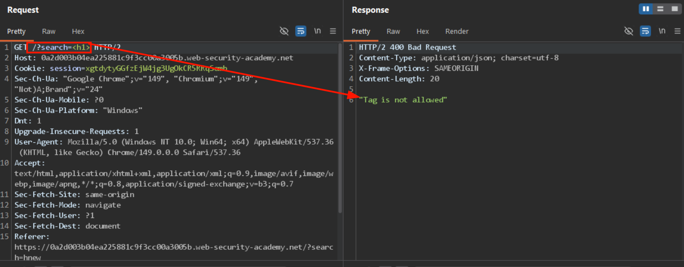
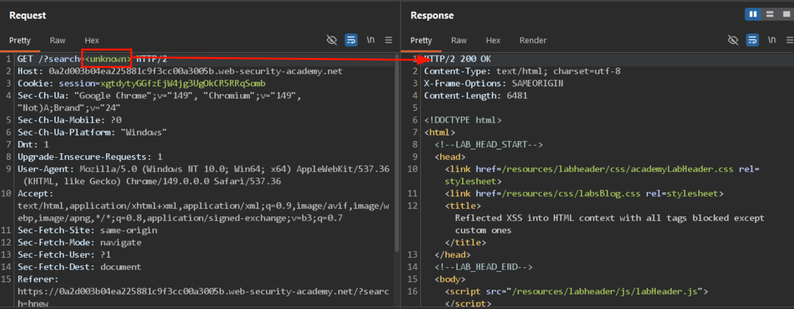
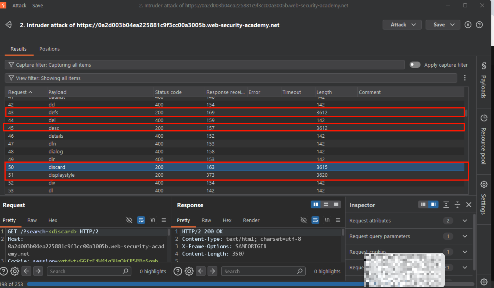
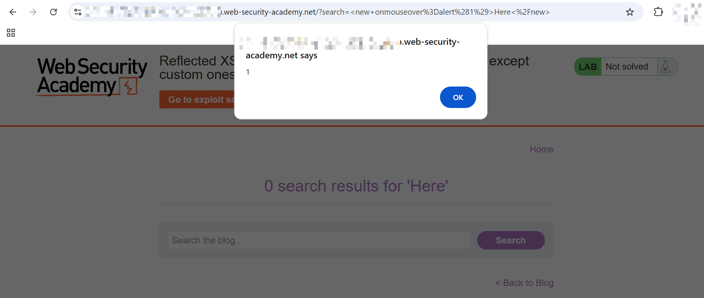

# Reflected XSS into HTML context with all tags blocked except custom ones

This lab blocks all HTML tags except custom ones. To solve the lab, I needed to perform a cross-site scripting attack that injects a custom tag and automatically alerts `document.cookie`.

---

# 1. Detection

The lab had a search bar to search for a post. I started with a simple test tag, `<h1>`, and searched. This gave me a 400 Bad Request with the response body `"Tag is not allowed"`.



To rule out the possibility that *all* non-whitelisted tags were being blocked (i.e. only real HTML tags), I also tried a completely made-up tag, `<unknown>`. This was rejected too.



So the filter wasn't simply "allow known-safe tags" — something more specific was going on, and I needed to figure out exactly which tags were and weren't accepted.

# 2. Enumerating the Filter

Rather than guessing tags one by one, I pulled a full list of HTML tags from [this gist](https://gist.github.com/Supercolbat/be320f5f17cf1808ca34fd319d1a1b71) and ran it through Burp Intruder against the `search` parameter.



The results were interesting: tags like `dd`, `del`, `details`, `dfn`, `dialog`, `dir`, `div`, and `dl` — all legitimate HTML tags — returned 400 with a short response length (142 bytes). But `defs`, `desc`, `discard`, and `displaystyle` returned 200 OK with a much larger response (3600+ bytes), meaning they were actually reflected into the page.

Notice that `defs` and `desc` are real (if obscure) SVG-related tags, while `discard` and `displaystyle` aren't standard HTML tags at all. This confirms the server is maintaining a **blacklist** of specific "dangerous" tag names (`div`, `del`, `dialog`, etc.) rather than a whitelist of safe ones — anything not explicitly on that blacklist gets through, real tag or not.

This also explains why `<unknown>` got blocked earlier — it's likely on the blacklist as a literal decoy/trap string, while genuinely obscure or made-up names like `<discard>` slip through simply because nobody thought to blacklist them.

# 3. First Working Payload

With `<new>` confirmed as one of the accepted tags, I tested:

```html
<new onmouseover=alert(1)>Here</new>
```

The request went out as `?search=<new+onmouseover%3Dalert%281%29>Here<%2Fnew>`, and hovering over the reflected text triggered the alert.



When I tried delivering this same payload to the simulated victim via the exploit server, the lab still didn't solve. **Why?** `onmouseover` requires the victim to physically move their mouse over the element. PortSwigger's automated victim simulation just loads the page — it doesn't perform random mouse movement. I needed a trigger that fires automatically on page load, with zero interaction.

# 4. Getting Automatic Execution

Since `<new>` isn't natively focusable (it's not an interactive element like `<input>` or `<a>`), I couldn't rely on `onfocus` alone. I needed to force it into the tab order using `tabindex="1"`.

That still doesn't auto-focus it, though — the browser needs a reason to focus that specific element on load. That's where the URL fragment identifier comes in. Appending `#x` to the URL tells the browser to locate the element with `id="x"` and focus/scroll to it as soon as the page finishes loading.

Putting it together:

```html
<new id=x onfocus=alert(document.cookie) tabindex="1">
```

...combined with a URL ending in `#x`.

**Why this works:** the browser's fragment-navigation behavior is designed for scrolling to anchors on load. When the target of that anchor happens to be a focusable element (thanks to `tabindex`), the browser also focuses it — and focusing it fires `onfocus`. No click, no hover, no real user interaction needed. This matches exactly how the automated victim simulator behaves: load the page, nothing else.

# 5. Final Payload & Delivery

Final injected search value:

```
<new id=x onfocus=alert(document.cookie) tabindex="1">
```

Full URL (URL-encoded):

```
https://0a48001703bff8d4806403a7009e004b.web-security-academy.net/?search=%3Cnew+id%3Dx+onfocus%3Dalert%28document.cookie%29+tabindex%3D%221%22%3E#x
```

To deliver this to the victim, I hosted the following redirect script on the PortSwigger exploit server:

```html
<script>
window.location = 'https://0a48001703bff8d4806403a7009e004b.web-security-academy.net/?search=%3Cnew+id%3Dx+onfocus%3Dalert%28document.cookie%29+tabindex%3D%221%22%3E#x';
</script>
```

<!-- Add lab-solved confirmation screenshot here once available, e.g.: -->
<!--  -->

When the victim's browser loads this exploit page, it's immediately redirected to the vulnerable search URL. The `<new>` tag gets reflected into the page, the `#x` fragment forces the browser to focus the element on load, and `onfocus` fires `alert(document.cookie)` — solving the lab with zero user interaction required.

# 6. Root Cause / Takeaway

The core issue here is a **blacklist-based tag filter**. Blacklists only block tags the developer specifically thought to include, so anything not on that list — including obscure real tags (`defs`, `desc`) or entirely made-up ones (`discard`, `displaystyle`, `new`) — sails through untouched. Since browsers don't require a tag to be a "real," recognized HTML element to honor its event-handler attributes, this alone is enough to achieve full script execution.

The correct fix is a **whitelist-based** approach: explicitly allow only a known-safe set of tags and attributes, and reject everything else by default — including unknown/custom tags and all `on*` event handler attributes.