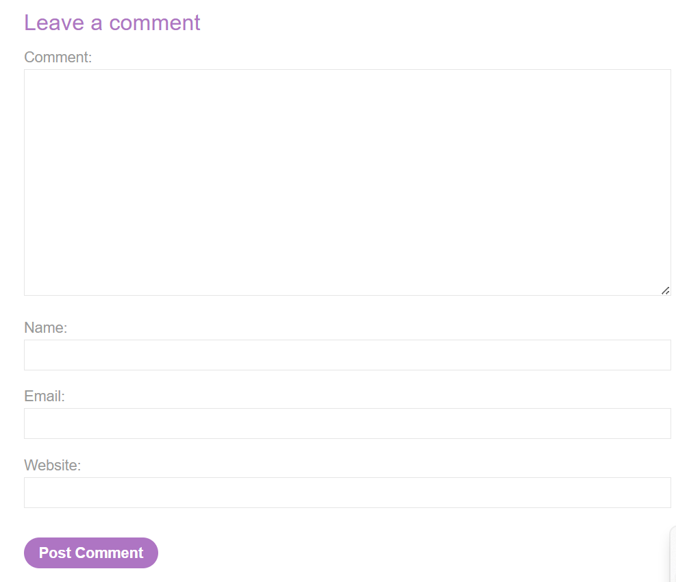
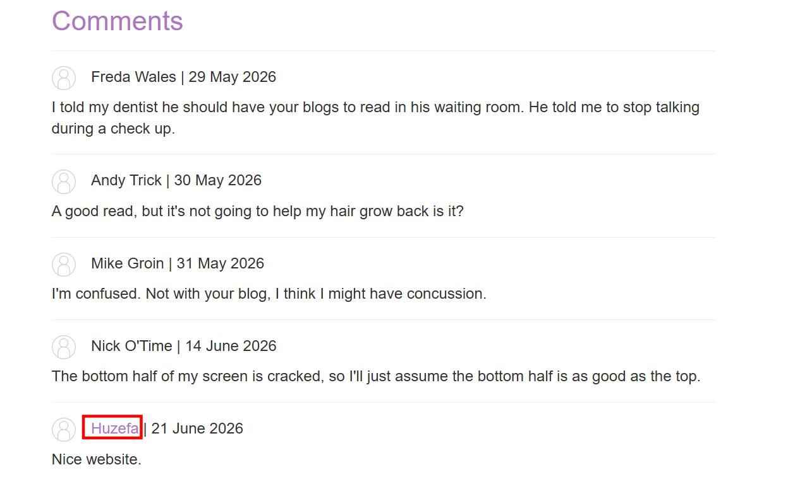
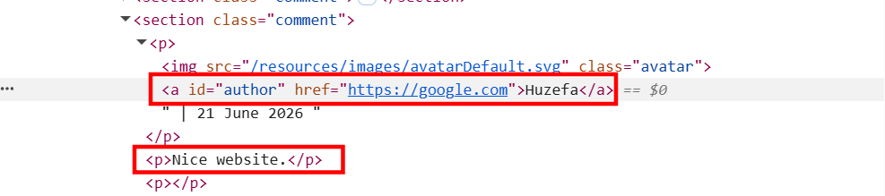
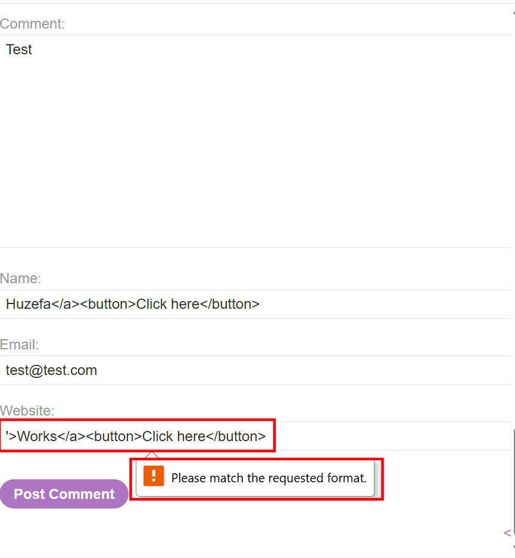

# Stored XSS into HTML context with nothing encoded

This lab contains a stored cross-site scripting vulnerability in the comment functionality.

To solve this lab, submit a comment that calls the `alert` function when the blog post is viewed.

---

# 1. Detection
- I clicked on `ACCESS THE LAB` button and accessed the web application.
- I clicked on `https://0a2a0038032f993380d08f8500d20023.web-security-academy.net/post?postId=5` post and started checking the comments.
- Since the lab suggests the vulnerability lies in the comment section, I started playing around the comment section.
- The comment section was asking the following fields
- 
- I simply posted a simple, test comment to understand how the web application was processing it.
- 
- I noticed that the application was rendering my name as an anchor tag to the website i gave in the input.
- I inspected the webpage to understand how my comment was being rendered by the application. The name was treated as an anchor to the website URL I gave and the comment was showing inside the paragraph tag.
- 
```html
<section class="comment">
   <p>
                                  <a id="author" href="https://google.com">Huzefa</a> | 21 June 2026
   </p>
   <p>Nice website.</p>
   <p></p>
</section>
```
- I was intrigued and curious to try if I can break/escape the anchor tag and execute my payload.
- I tried the following payloads:-
    - Under the name section, I tried this to possibly escape the `<a>` tag.
```html
Huzefa</a><button>Click here</button>
```
- Under the website, I tried using the following payload:-
```html
'>Works</a><button>Click here</button>
```
- However, I got the default pattern violation prompt by the browser.
- 
- I inspected the page to understand what pattern the input's `pattern` attribute expects to identify a valid URL. It was simply the following.
```html
<input pattern="(http:|https:).+" type="text" name="website">
```
- This means the input was checking if the string contains `"http:"` or `"https:"`. That's it. Nothing else.
- So the bypass was simple, I added what it `trusts`.
```html
http:'>Works</a><button>Click here</button>
```
- The form was submitted without form's pattern violations, but it didn't worked, looks like proper sanitizing was going on the server-side.
```html
http:">Works</a><button>Click here</button>
```
- I also tried the above, still no success.
- Then I tried injecting a simple html tag in the most obvious input field. Th comment input itself.
```html
<button>Works</button>
```
- This time, my HTML tags were rendered as a button with textContent as `Works`.

# Triggering an Alert (Lab Solved)
- Withour further a do, I injected the following payload in the comment input.
```javascript
<script>
"alert" in window ?
window.alert() :
void 0
</script>
```
- This triggered an alert box and solved the lab as well :).