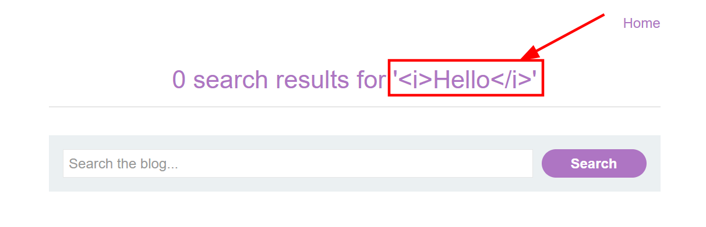
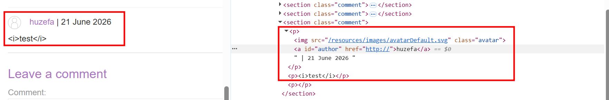
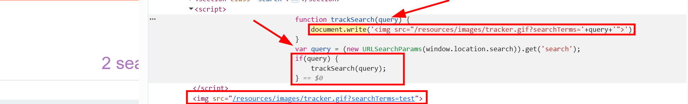
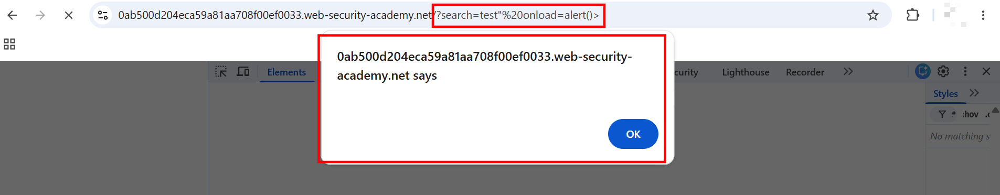

# DOM XSS in document.write sink using source location.search

This lab contains a DOM-based cross-site scripting vulnerability in the search query tracking functionality. It uses the JavaScript `document.write` function, which writes data out to the page. The `document.write` function is called with data from `location.search`, which you can control using the website URL.

To solve this lab, perform a cross-site scripting attack that calls the `alert` function.

---

# 1. Detection

- I accessed the lab and had the search functionality and the posts visible on the home page.
- I started by injecting a simple payload in the search bar, just to see how the app handles it.

```html
<i>Hello</i>
```

- But it got reflected as-is, not rendered. It literally showed up as text on the page instead of getting interpreted as HTML.
- 

- Then I clicked on one of the posts and tried inserting HTML payloads in the comment form too, but no luck there either. Looked like proper sanitization was happening there.
- 

# 2. Re-reading the Lab Description

- Since both my attempts failed, I went back and re-read the lab description properly. It clearly mentioned that the vulnerability is in the search query tracking functionality, and it uses `document.write` with data from `location.search`.
- So I went back to the search bar, typed "test", hit search, and opened dev tools to inspect the page source.
- I searched for "document.write" in the source and kept pressing <kbd>Enter</kbd> to jump through matches until something interesting showed up.
- Found it on the 4th match.
- 

```javascript
function trackSearch(query) {
    document.write('');
}
var query = (new URLSearchParams(window.location.search)).get('search');
if (query) {
    trackSearch(query);
}
```

# 3. Understanding the Sink

- The `trackSearch` function takes a parameter `query` and, without any validation or sanitization, shoves it straight into `document.write`, inside the `src` attribute of an `` tag.
- `document.write` writes raw HTML/JS directly into the page, so whatever lands inside it gets parsed as actual markup, not just text.
- The `query` variable comes from `location.search`, which holds the full query string of the URL (the part after `?`). But since the code does `.get('search')` on it via `URLSearchParams`, it only pulls out the value of the `search` parameter, nothing else.
- So if the URL is `https://example.com/?search=huzefa`, `location.search` would give `?search=huzefa`, but `.get('search')` just returns `huzefa`.
- If `query` is truthy, `trackSearch(query)` gets called, and the value goes straight into `document.write` with zero filtering.
- For a normal search like `test`, this is what gets written to the page:

```html

```

# 4. Triggering an Alert (Lab Solved)

- Since the input wasn't being sanitized at all before hitting `document.write`, I figured I could just break out of the `src` attribute and add my own event handler.
- I used the following payload:

```
/?search=test"%20onload=alert()%20>
```

- Used `"` instead of `'` here because looking at the source, `document.write` wraps the `` tag's `src` value inside double quotes, not single ones. So closing it with `"` was the right move to break out cleanly.
- This closed the `src` attribute early, added an `onload=alert()` handler on the `` tag, and closed the tag off.
- Popped the alert box and solved the lab.
- 