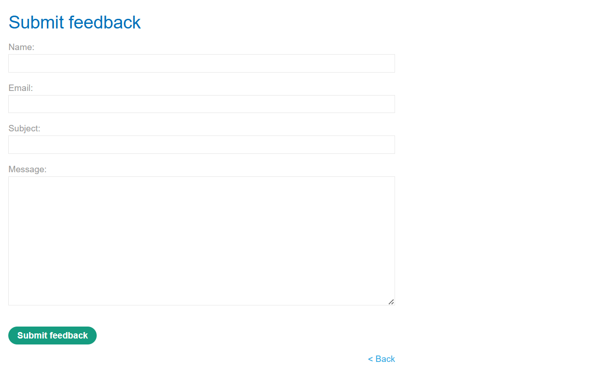
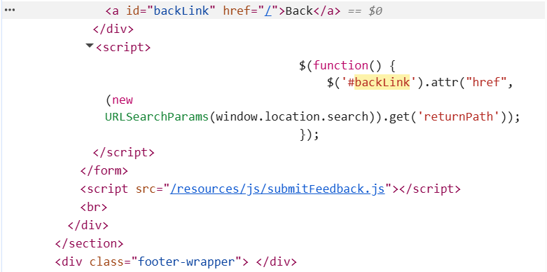
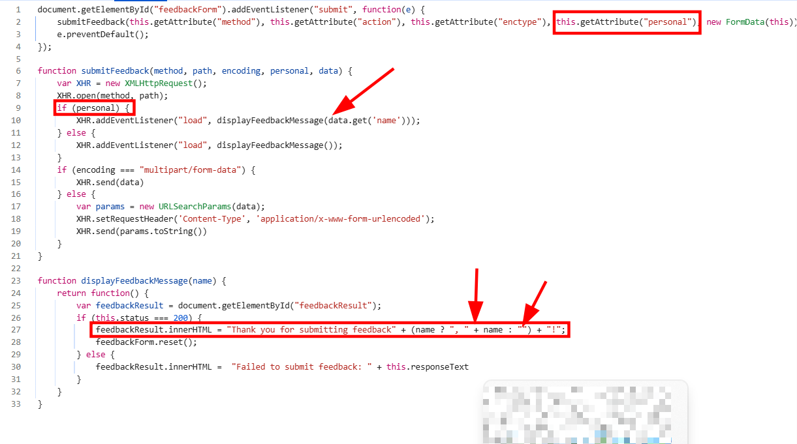
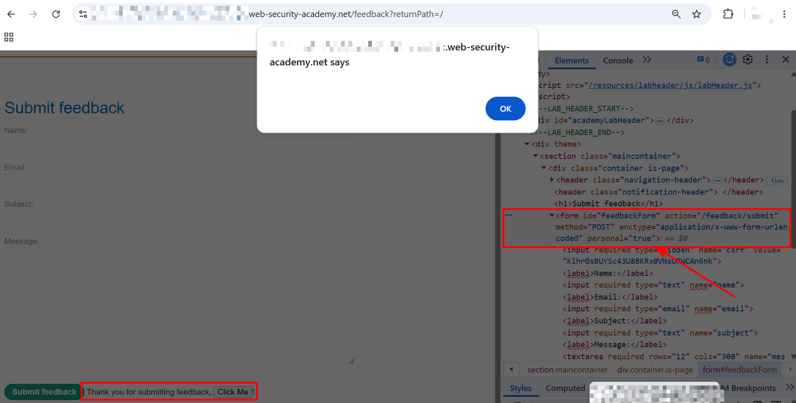

# DOM XSS in jQuery anchor `href` attribute sink using `location.search` source

This lab contains a DOM-based cross-site scripting vulnerability in the submit feedback page. It uses the jQuery library's `$` selector function to find an anchor element, and changes its `href` attribute using data from `location.search`.

To solve this lab, make the "back" link alert `document.cookie`.

---

# 1. Detection

- Clicked on `ACCESS THE LAB` and got redirected to the lab.
- On the homepage, there was a button to submit feedback, which took me to `/feedback?returnPath=/`.
- Clicked on it and got a basic feedback form, with Name, Email, Subject, Message fields and a Submit feedback button.
- 
- Submitted the form just to see what happens. Got a message saying "Thank you for submitting feedback!" below the form.
- As per the lab description, the vulnerability lies in the `< Back` link at the bottom of the form, so I right clicked and inspected that specifically.

# 2. Finding the Sink

- Found the `< Back` link in the DOM:

```html
<a id="backLink" href="/">Back</a>
```

- And right below it, the script handling it:

```javascript
$(function() {
    $('#backLink').attr("href", (new URLSearchParams(window.location.search)).get('returnPath'));
});
```

- 
- Logic was straightforward. The element with id `backLink` gets its `href` attribute set to whatever value is passed in the `returnPath` URL parameter. No sanitization, no validation, no check whether it's actually a relative path or not. jQuery's `.attr()` just sets it as-is.

# 3. Triggering an Alert (Lab Solved)

- Since `href` accepts pretty much anything, including `javascript:` URIs, the exploit was simple.
- Used the following URL:

```
/feedback?returnPath=javascript:alert(document.cookie)
```

- This set the `< Back` link's `href` to `javascript:alert(document.cookie)`. So when the user clicks the back link, instead of navigating anywhere, the browser just runs the JS inside the `href`.
- Clicked the `< Back` button, alert popped up showing the cookie value, and the lab got solved.

---

# Bonus — Unintended Self-XSS (Not the Lab's Goal)

- While I was still figuring out how `#backLink` worked, before I found the inline script above, I was going through the JS files loaded on the page instead of just checking the rendered element. One file caught my eye: `/resources/js/submitFeedback.js`.
- Read through it:

```javascript
document.getElementById("feedbackForm").addEventListener("submit", function(e) {
    submitFeedback(this.getAttribute("method"), this.getAttribute("action"), this.getAttribute("enctype"), this.getAttribute("personal"), new FormData(this));
    e.preventDefault();
});

function submitFeedback(method, path, encoding, personal, data) {
    var XHR = new XMLHttpRequest();
    XHR.open(method, path);
    if (personal) {
        XHR.addEventListener("load", displayFeedbackMessage(data.get('name')));
    } else {
        XHR.addEventListener("load", displayFeedbackMessage());
    }
    if (encoding === "multipart/form-data") {
        XHR.send(data)
    } else {
        var params = new URLSearchParams(data);
        XHR.setRequestHeader('Content-Type', 'application/x-www-form-urlencoded');
        XHR.send(params.toString())
    }
}

function displayFeedbackMessage(name) {
    return function() {
        var feedbackResult = document.getElementById("feedbackResult");
        if (this.status === 200) {
            feedbackResult.innerHTML = "Thank you for submitting feedback" + (name ? ", " + name : "") + "!";
            feedbackForm.reset();
        } else {
            feedbackResult.innerHTML = "Failed to submit feedback: " + this.responseText
        }
    }
}
```

- 
- Here's the interesting bit: if the form has a `personal` attribute set to a truthy value, the app passes `data.get('name')` (the name field from the form) straight into `displayFeedbackMessage`, and that gets dumped into `feedbackResult.innerHTML` with zero sanitization.
- This only triggers if the form tag itself carries `personal="true"`, like:

```html
<form id="feedbackForm" action="/feedback/submit" method="POST" enctype="application/x-www-form-urlencoded" personal="true">
```

- Normally the form doesn't have this attribute, but since it's just a DOM attribute, nothing's stopping me from manually adding it through dev tools before submitting.
- Set `personal="true"` on the form, then in the Name field put:

```html
<button onclick="alert(document.cookie)">Click Me</button>
```

- Submitted the form, and the button rendered properly in the "Thank you for submitting feedback" message. Clicking it fired the alert with the cookie.
- 
- This is technically a self-XSS though, since it needs the attacker to manually tamper with their own form's `personal` attribute before submitting, so it's not really exploitable against another user. Wasn't the actual goal of the lab, just something I stumbled on while poking around. Noting it down anyway.