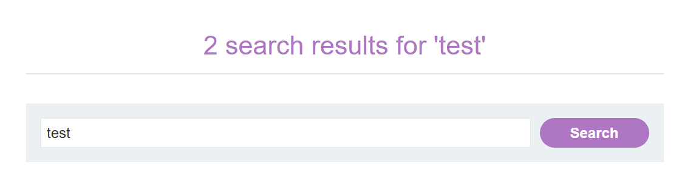
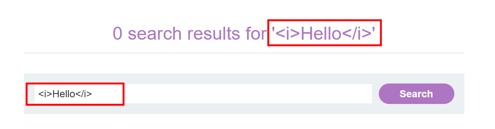
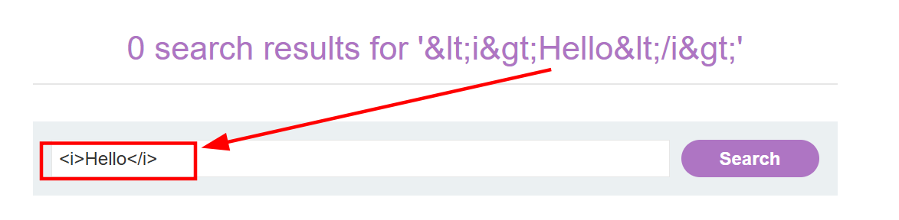
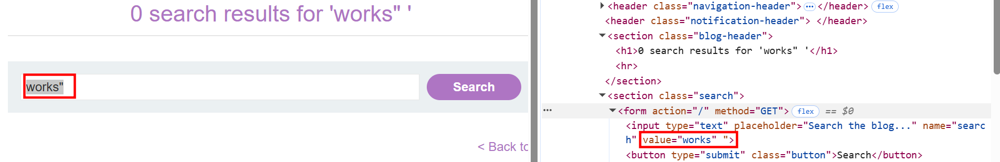
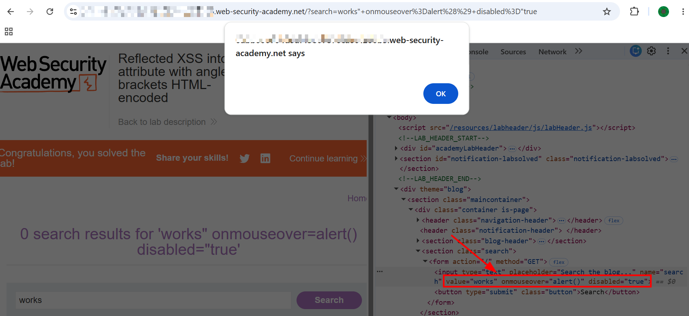

# Reflected XSS into attribute with angle brackets HTML-encoded

This lab contains a reflected cross-site scripting vulnerability in the search blog functionality where angle brackets are HTML-encoded. To solve this lab, perform a cross-site scripting attack that injects an attribute and calls the `alert` function.

---

# 1. Detection

- Accessed the lab and was presented with a search box to search for blogs.
- Entered "test" just to see how the input gets reflected back on the page.
- 
- The search term was being reflected both in the results heading and inside the search input's `value` attribute.

# 2. Testing for HTML Injection

- Tried a basic HTML tag to check if the app renders it:

```html
<i>Hello</i>
```

- The tag showed up as raw text in the results heading — angle brackets were not rendered, just displayed as-is.
- 
- Then tried entering HTML entities manually:

```
&lt;i&gt;Hello&lt;/i&gt;
```

- The heading showed the double-encoded version and the input field normalized it back to `<i>Hello</i>` visually.
- 
- So angle brackets were clearly being HTML-encoded on the server side. No way to inject tags through the heading reflection directly.

# 3. Finding the Real Injection Point

- But then I noticed something — my input wasn't just being reflected in the `<h1>` heading. It was also being placed inside the search input's `value` attribute like this:

```html
<input type="text" placeholder="Search the blog..." name="search" value="test">
```

- So the reflection was happening in two places. The heading encodes angle brackets, but what about the `value` attribute? I wondered if I could break out of the attribute itself instead of trying to inject HTML tags.
- Entered `works"` in the search box and inspected the input element in dev tools.
- 
- The `"` actually closed the `value` attribute early, leaving a dangling quote after it:

```html
<input type="text" value="works" ">
```

- The attribute context was breakable. The app was only encoding angle brackets, not double quotes.

# 4. Triggering an Alert (Lab Solved)

- Since I could break out of `value` with a `"`, I just needed to add an event handler attribute right after it.
- Used the following payload:

```
works" onmouseover=alert() disabled="true
```

- Breaking this down:
    - `works"` — puts a value in the field and closes the `value` attribute with `"`.
    - `onmouseover=alert()` — injects a new attribute on the input, which fires `alert()` when the user hovers their mouse over the field.
    - `disabled="true` — disables the input and opens a new attribute value with `"` to soak up the leftover closing `"` from the original attribute, keeping the HTML valid.

- This rendered in the DOM as:

```html
<input type="text" value="works" onmouseover="alert()" disabled="true">
```

- Hovered the mouse over the input field, alert popped, lab solved.
- 