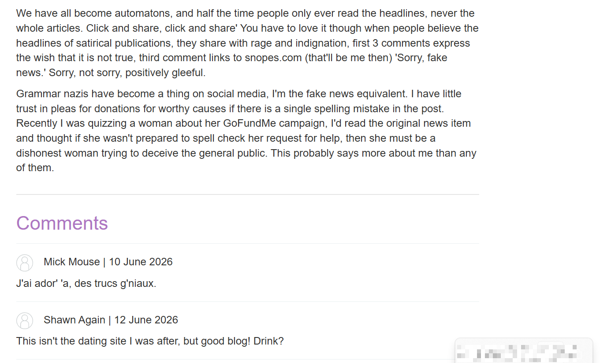
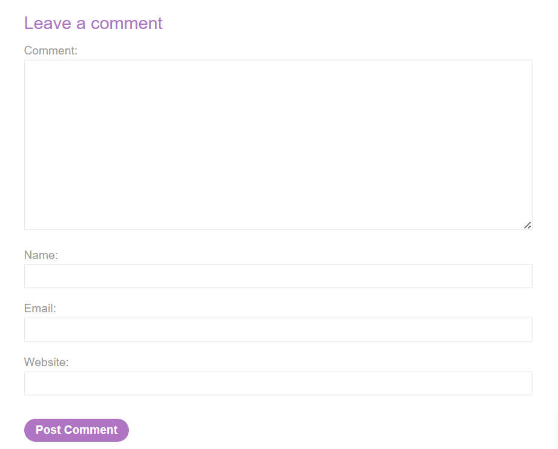
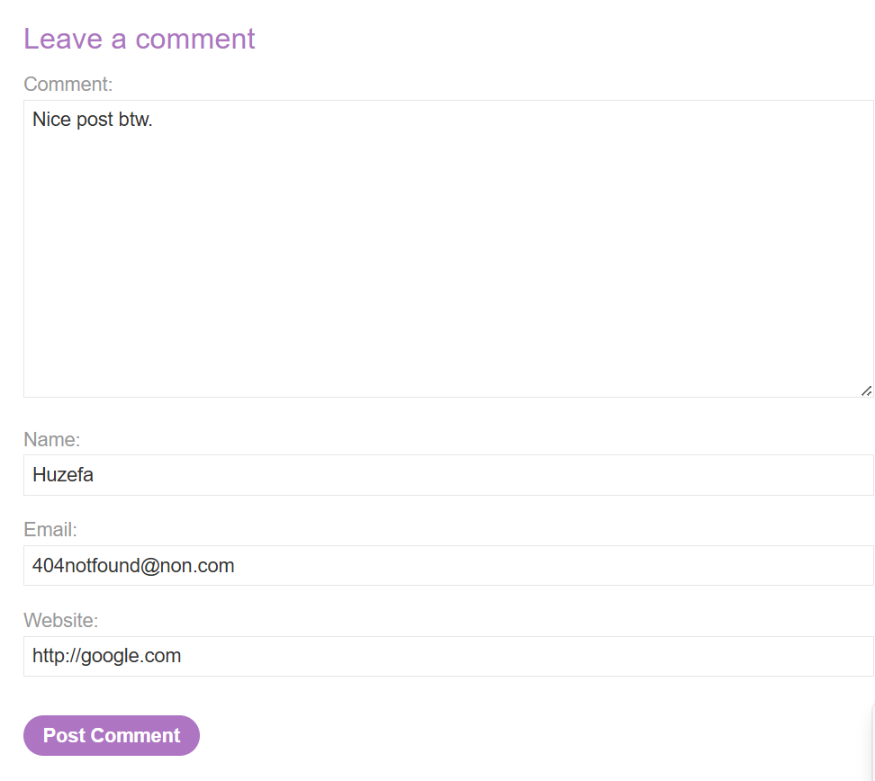
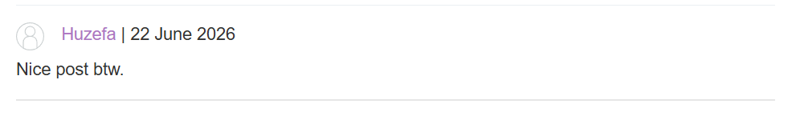
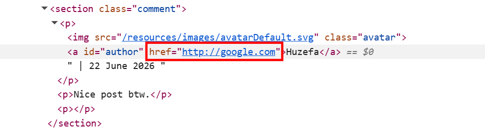
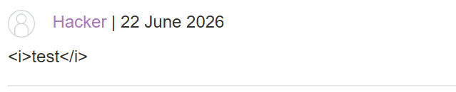
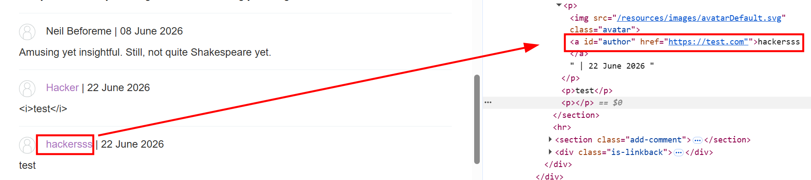
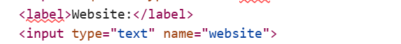
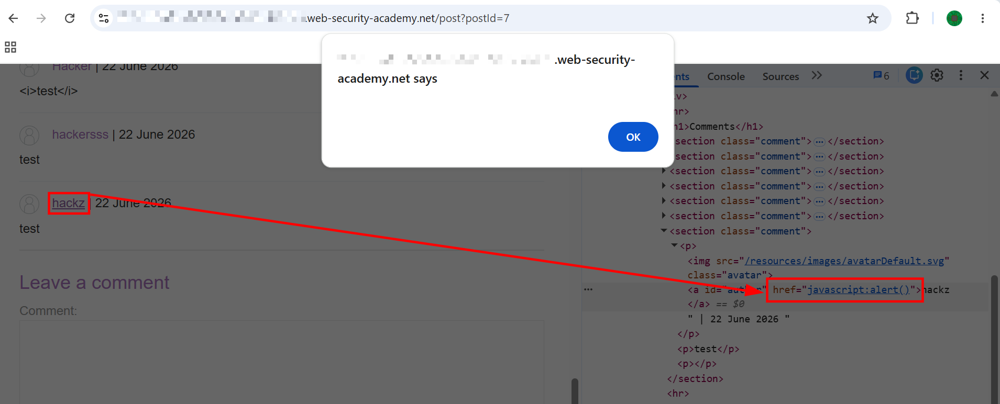

# Stored XSS into anchor `href` attribute with double quotes HTML-encoded

This lab contains a stored cross-site scripting vulnerability in the comment functionality. To solve this lab, submit a comment that calls the `alert` function when the comment author name is clicked.

---

# 1. Detection

- Accessed the lab and opened one of the blog posts (`post?postId=9`). The page had a comments section at the bottom with existing comments from other users.
- 
- Scrolled down and found the "Leave a comment" form. It had fields for Comment, Name, Email, and Website.
- 
- Filled in the form with some basic test data just to see how the app processes and displays comments.
- 

# 2. Observing How the Comment Gets Rendered

- My comment got posted successfully.
- 
- I noticed that my name in the comment section was in a different color (purple/blue) compared to the other plain text names, and hovering over it showed it was a clickable link pointing to the website URL I had provided.
- Inspected that element in dev tools to understand how it was being rendered. Found the following:

```html
<a id="author" href="http://google.com">Huzefa</a>
```

- 
- So the website URL I provide goes directly into the `href` attribute of the anchor tag, and my name becomes the link text. Good to know.

# 3. Testing the Comment Field

- Before going after the `href`, I decided to try a basic HTML injection in the comment field itself, just to cover all bases.
- Posted a comment with `<i>test</i>` as the comment body.
- The tags did not get rendered at all, showed up as raw text in the comment.
- 
- Comment field was sanitizing or encoding HTML tags, so no luck there.

# 4. Testing the Website Field

- Since I already knew the website URL goes into the `href` attribute, I tried to break out of it using a double quote:

```
https://test.com"
```

- Inspected the rendered output:

```html
<a id="author" href="https://test.com"">hackersss</a>
```

- 
- The double quote just got appended after `.com` but didn't break out of the attribute — it was clearly being HTML-encoded on the server side. Tried with a single quote too, same result.

# 5. Noticing the Missing Pattern Validation

- Went back and looked at the website input field more carefully in the source:

```html
<input type="text" name="website">
```

- 
- Unlike the lab before this one, there was no `pattern="(http:|https:).+"` validation on the input. No frontend check enforcing that the URL starts with `http:` or `https:`.
- This made me think — if the frontend isn't validating the URL format, maybe the backend isn't either. What if I just pass a `javascript:` URI instead of an actual URL?

# 6. Triggering an Alert (Lab Solved)

- Put the following payload in the Website field:

```
javascript:alert(1)
```

- Submitted the comment. The server accepted it without any complaints — no URL format validation on the backend either.
- Clicked on my name in the comment, and since the `href` was now set to `javascript:alert(1)`, the browser executed it directly instead of navigating anywhere.
- Alert popped, lab solved.
- 