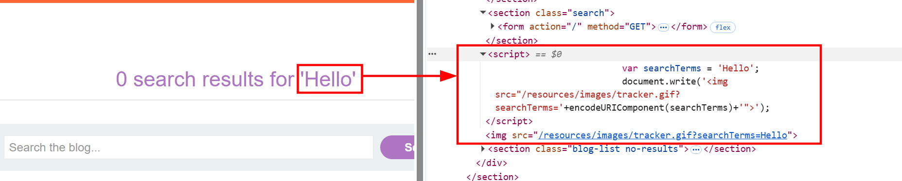
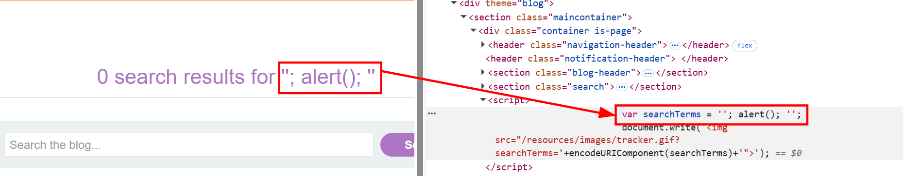
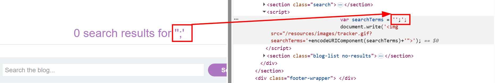
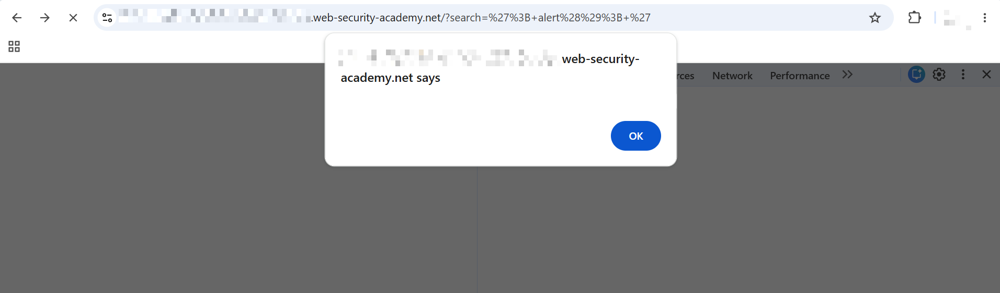

# Reflected XSS into a JavaScript string with angle brackets HTML encoded

This lab contains a reflected cross-site scripting vulnerability in the search query tracking functionality where angle brackets are encoded. The reflection occurs inside a JavaScript string.

To solve this lab, perform a cross-site scripting attack that breaks out of the JavaScript string and calls the `alert` function.

---

## 1. Detection

- Accessed the lab and was given a search input on the blog.
- Searched for `Hello` for testing, to understand how the application renders the text.
- The text was being reflected on the page as `0 search results for 'Hello'`.


- Inspected the `Hello` text on the page and found that it was being wrapped inside an `<h1>` tag visually, but the actual reflection point was inside a `<script>` block, assigned to a JavaScript variable named `searchTerms`:

```html
<script>
    var searchTerms = 'Hello';
    document.write('');
</script>

```



- This confirmed the injection point was inside a single-quoted JavaScript string, not raw HTML — so the goal was to break out of the `searchTerms` string assignment rather than inject HTML tags.

---

## 2. Breaking Out of the JavaScript String

- Since angle brackets (`<`, `>`) are HTML-encoded by the application, injecting `<script>` tags directly wouldn't work. The string context meant the escape had to be done using quotes and semicolons instead.
- Used the following test payload in the search box to attempt to terminate the string early:

```javascript
';
```

- Checked the rendered page — the search term displayed was `";'` and the underlying JavaScript was now:

```javascript
var searchTerms = '';';
```



- Inspecting the DOM confirmed `searchTerms` had been truncated to an empty string by the injected `'`, and the trailing `;` was now sitting outside the string entirely:



- Confirmed this in the browser console by checking `searchTerms.length`, which returned `0` — proving the injected quote was being interpreted as real JavaScript syntax by the browser, not just reflected as text.

---

## 3. Solve the Challenge

- With the string-breakout confirmed, updated the payload to inject a working `alert()` call between the breakout and the line termination, then appended a closing `'` to keep the rest of the original line syntactically valid:

```javascript
'; alert(); '
```

- This worked by:
  - `'` — closing the original `searchTerms` string early
  - `;` — terminating that statement
  - `alert()` — the actual XSS payload, now executed as a standalone JS statement
  - `;` — terminating the alert statement
  - `'` — a dummy opening quote to balance the trailing `'` left over from the original source line, preventing a syntax error

- Submitted the payload in the search box. The `alert()` fired successfully in the browser:



- The resulting injected script block looked like:

```javascript
var searchTerms = ''; alert(); '';
```

- Lab solved.